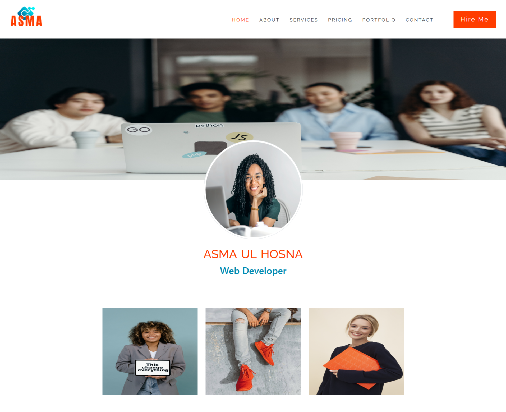
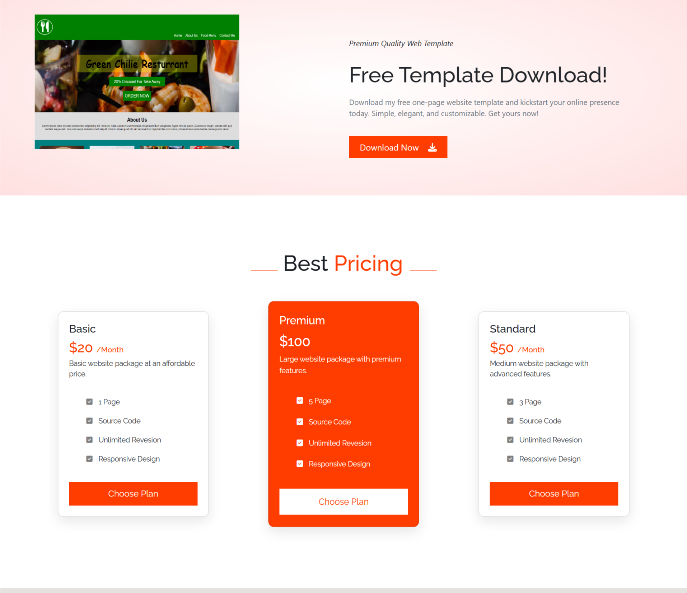

   &nbsp;
  

# Portfolio Website 
A responsive personal portfolio website showcasing skills, projects, and contact information. The site is designed to be clean, modern, and user-friendly.

## Features
- **Responsive Design**: Works perfectly on desktop, tablet, and mobile devices.
- **Home Section**: Attractive introduction and hero banner.
- **About Section**: Brief details about the developer.
- **Skills Section**: Showcases technical skills with icons and highlights.
- **Projects Section**: Displays completed projects with descriptions and links.
- **Contact Section**: Contact form and social media links for easy communication.

  ## Technologies Used
- HTML5  
- CSS3  
- JavaScript  
- Bootstrap 5
- 
## Live Demo
[View Live Website](https://webbyhosna.github.io/portfolio-site-asma/)

## Installation
1. Clone the repository:  
   `git clone https://github.com/webbyhosna/portfolio-site-asma.git`
2. Open `index.html` in your browser.

   ## Author
[Asma Ul Hosna](https://github.com/webbyhosna)
